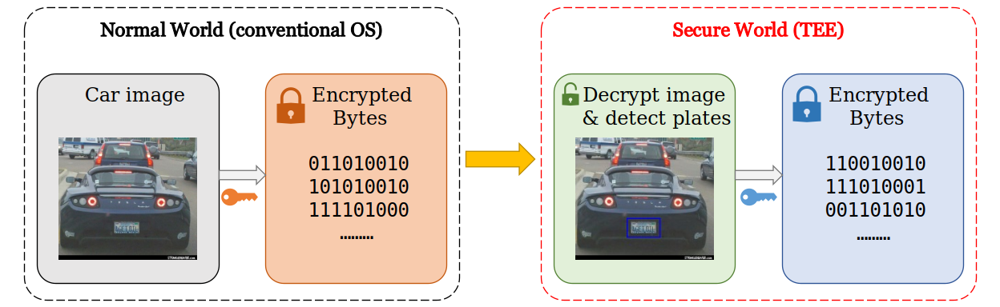

### Introduction
This repository contains a simple application that runs on TrustZone, a trusted execution environment (TEE) on ARM processors. It is written on top of [OPTEE](https://github.com/OP-TEE/optee_os), and follows the structure of [other OPTEE examplar applications](https://github.com/linaro-swg/optee_examples). This application takes encrypted images from the normal world, i.e., the conventional OS. It hence decrypt the image, detect and mark car plates in it, encrypt it again and return the result to the normal world as a byte array. The diagram below shows the pipeline of the application. The yellow arrow in the middle is the CA (client application) that transfers encrypted images through secure data path to TEE. The part enclosed in red dashed line is the TA (trusted application) that resides inside TEE and processes the images.



### Compiling
Move the entire repository under `optee_examples` folder of the OPTEE OS mentioned above, then it
can be compiled together with OPTEE without external configuration changes. It relies on math dynamic linked library (libm), which is already
included under `ta/include`.

### Running
After compiling, run the `optee_example_cv` program under the folder that has the test images. The program accepts one argument that specifies how many images to use.
The test files should be named `Cars#_crop_sec` where the # denotes the number of that test image. The [img](./imgs) folder contains the ones used in the benchmarking. 
After mounting and entering this folder to QEMU, execute `run.sh` in the normal console for the benchmark. For each run, the throught will be printed out in the normal
world console.
```
# optee_example_cv 20
optee_example_cv 20
throughtput: 0.96 img/s on 20 samples
```

### Known issues
Won't work on images of ~300KB or larger, or those become larger than this size after processing.

### Reference
- This is part of an assginment from an operating system course at UVA. The original instructions can be found [here](https://fxlin.github.io/p3-tee/secure-vision/).
- The computer vision library used in object detection is [SOD](https://sod.pixlab.io/).
